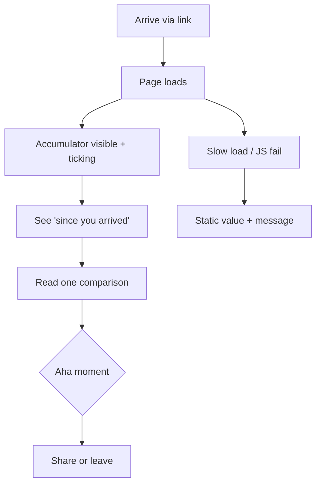
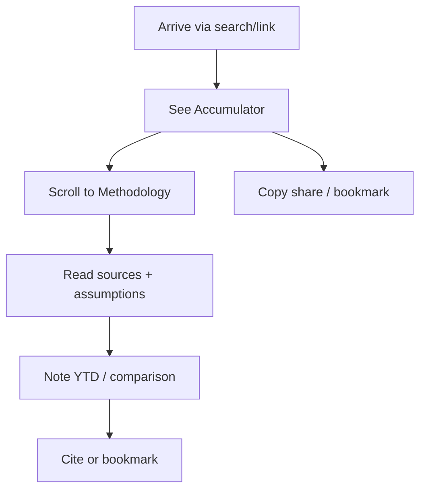
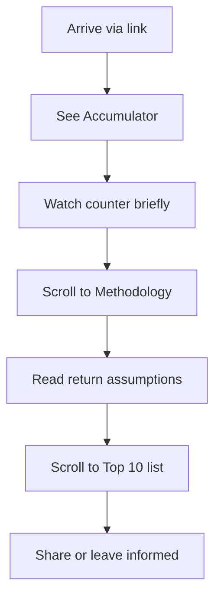

# UX Design Specification WealthTracker-1

**Author:** Aaron
**Date:** 2026-03-07

---

## Executive Summary

### Project Vision

WealthTracker is a public-facing inequality calculator that makes billionaire passive income visible in real time. The centrepiece is the **Accumulator** — a live counter showing the combined passive income of the world's 10 richest people, ticking up as visitors watch. The product reframes inequality from static net-worth figures to the *flow* of wealth, with the goal of shifting public perception toward support for wealth taxation. Positioning: "A calculator for inequality, not a celebrity tracker." Target aha moment: *"They make more asleep than I'll make in my lifetime."*

### Target Users

- **Primary — The Scrolling Public:** Regular people who arrive via social or news; they need instant impact, zero friction, and an experience that feels shareable. Success = visceral understanding and a memorable, shareable takeaway.
- **Secondary — Journalists & Educators:** Need credible, citable data with clear methodology, sources, and timestamps.
- **Secondary — Policy-Curious Readers:** Want transparent methodology, understandable assumptions, and optional depth (e.g. return rates, individual breakdowns).

### Key Design Challenges

- **Emotional impact in seconds:** The Accumulator must read as "live" and meaningful immediately, especially above the fold on mobile where most discovery and sharing happen.
- **Credibility without clutter:** The same page must satisfy journalists (methodology, sources, dates) without overwhelming casual visitors.
- **Performance and perception:** The real-time counter must feel smooth and load fast; lag or jank would undermine the "it's happening now" feeling.

### Design Opportunities

- **Single-screen hierarchy:** Lead with the Accumulator and "since you arrived"; use scroll for comparisons, top 10 list, and methodology. Strong information architecture and progressive disclosure can maximize impact.
- **Shareability by design:** Messaging, visuals, and share UI can be tuned so the aha moment is easy to pass on (e.g. pre-filled share text, clear CTAs).
- **Trust through transparency:** Making methodology, assumptions, and sources visible and scannable can double as a differentiator and a clear UX pattern (e.g. dedicated methodology block or section).

---

## Core User Experience

### Defining Experience

The core experience is **watching the Accumulator** — a single, continuous action. Users land, see the combined passive income of the top 10 billionaires ticking up in real time, and optionally see "since you arrived." No signup, no navigation, no decisions required. The one thing that must be perfect is that the counter feels live, legible, and consequential from the first second. Supporting actions (reading a comparison, scanning the top 10, opening methodology, sharing) are secondary; if watching the Accumulator works, the rest supports it.

### Platform Strategy

- **Primary:** Web (SPA), mobile-first. Most discovery and sharing happens on phones; the Accumulator must be above the fold and readable on 320px–768px.
- **Input:** Touch-first (tap, scroll); mouse/keyboard for desktop. Share and any CTAs must meet minimum touch target size (e.g. 44×44px).
- **Constraints:** No offline requirement for MVP. No app install; link-based sharing. Leverage browser APIs for share where available.
- **Performance:** Accumulator visible within 2 seconds on 3G; counter updates smooth (e.g. 60fps) so it feels real-time.

### Effortless Interactions

- **Land and understand:** User does nothing except scroll; the value is visible immediately. No onboarding, no "Get started."
- **"Since you arrived":** Session counter updates automatically; no interaction required — it reinforces the message while they read.
- **Scroll for depth:** One vertical scroll reveals comparisons, top 10 list, then methodology. No tabs or modals required for core content.
- **Share:** One tap to open native share or copy a prepared message; no account or form.
- **Trust:** Methodology and sources are on the same page, scannable; no hunting for credibility.

### Critical Success Moments

- **First 2 seconds:** Accumulator is visible and clearly "live" (numbers updating). If this fails, the gut-punch is lost.
- **First 30 seconds:** User has seen the main total and "since you arrived"; they feel the scale.
- **First comparison read:** One relatable line (e.g. "earns your annual salary every X minutes") lands — the aha moment.
- **Share decision:** User chooses to share because the framing and visuals make it easy and compelling.

First-time success = land → see counter → feel impact → (optionally) scroll, read methodology, share.

### Experience Principles

1. **Instant impact** — The Accumulator is the hero; no steps before "getting it."
2. **Zero friction** — No signup, no navigation, no configuration; the page does the work.
3. **Credibility visible** — Methodology and sources are present and findable without burying the main message.
4. **Shareability by default** — Copy, visuals, and share UI are designed so the aha moment is easy to pass on.
5. **Performance as UX** — Fast load and smooth updates are part of the experience; lag undermines "it's happening now."

---

## Desired Emotional Response

### Primary Emotional Goals

- **Visceral clarity** — Users should *feel* the scale of inequality, not just read it. The target is a sobering "I get it now" rather than abstract numbers.
- **Compelled to share** — The experience should feel worth passing on: "You have to see this." Sharing is framed as spreading understanding, not preaching.
- **Trust in the numbers** — Users (especially journalists and policy-curious) should feel the data is credible and transparent, not advocacy spin.

### Emotional Journey Mapping

- **Discovery (landing):** Curiosity and slight intrigue — "What is this?" — with no sense of being lectured.
- **Core experience (watching Accumulator):** Growing realization and impact — the counter makes inequality tangible. "Since you arrived" adds a personal, immediate stake.
- **After reading a comparison:** The aha moment — e.g. "They earn my salary in X minutes" creates a lasting, shareable takeaway.
- **After scrolling / methodology:** Confidence and trust — "This is serious and well-sourced."
- **When sharing:** Sense of agency — "I'm sharing something that matters."
- **If something fails (e.g. counter stuck, slow load):** Avoid frustration and doubt; the "it's happening now" feeling depends on reliability.

### Micro-Emotions

- **Clarity over confusion** — Big numbers are translated into relatable comparisons; no mental math required.
- **Trust over skepticism** — Methodology and sources visible; tone is factual, not sensational.
- **Sobering realization over guilt or preachiness** — The math does the work; the product doesn't moralize.
- **"I can share this" over "I don't want to be that person"** — Share UI and framing make it easy and natural to pass on.

### Design Implications

- **Live counter + "since you arrived"** → Makes the scale feel real and personal; supports visceral clarity.
- **One clear comparison line** → Anchors the aha moment and gives a shareable quote.
- **Visible methodology and sources** → Builds trust without pulling focus from the main message.
- **No signup, no gates** → Reduces friction and keeps the tone open, not pushy.
- **Single-tap share + prepared copy** → Reduces friction and supports "compelled to share."
- **Fast, smooth performance** → Keeps the experience credible; lag undermines "it's happening now."

### Emotional Design Principles

1. **Show, don't preach** — Let the numbers and the live counter create the impact; avoid moralizing copy.
2. **Make scale tangible** — Use time and salary comparisons so users feel the gap, not just see digits.
3. **Earn trust visibly** — Transparency (methodology, sources, assumptions) supports credibility and sharing.
4. **Design for the share moment** — Copy, visuals, and share UI should make "you have to see this" easy and natural.
5. **Respect the gravity** — Tone is serious and factual; avoid glib or gamified framing that could undermine the message.

---

## UX Pattern Analysis & Inspiration

### Inspiring Products Analysis

**Real-time counters and "live" data displays (e.g. national debt clocks, carbon/climate counters)**  
- **What they do well:** One number or counter as hero; immediate "this is happening now" feeling; no onboarding.  
- **Relevance:** Same "live ticker" mechanic as the Accumulator; reinforces that the number is current and real.  
- **Lesson:** Keep the hero element singular and legible; avoid competing numbers above the fold.

**Transparent data and methodology sites (e.g. Our World in Data, Gapminder, serious data journalism)**  
- **What they do well:** Clear sourcing, methodology sections, "how we calculated this"; builds trust for journalists and curious readers.  
- **Relevance:** WealthTracker needs to feel citable and credible; methodology on the same page supports that without feeling academic.  
- **Lesson:** Integrate methodology and sources into the scroll flow so trust is visible without a separate "report" feel.

**Single-page advocacy and viral explainers**  
- **What they do well:** One scroll, one story; strong headline and one clear comparison or fact; share-friendly framing.  
- **Relevance:** Matches "single page, maximum impact" and shareability; one strong comparison line drives the aha moment.  
- **Lesson:** One primary shareable fact (e.g. "earns your salary every X minutes"); support with depth below, not clutter above.

### Transferable UX Patterns

- **Hero counter, no chrome** — One dominant live number, minimal nav and UI above the fold; all focus on the Accumulator.  
- **Progressive disclosure via scroll** — Comparisons → top 10 → methodology in one vertical flow; no tabs or modals for core content.  
- **"Since you arrived" as personal hook** — Session-scoped secondary counter (like "your impact" or "while you've been here") to make the abstract personal.  
- **Methodology as part of the page** — Dedicated section with assumptions, sources, and dates; scannable and linkable for citations.  
- **Share: one tap + pre-written line** — Native share or copy with a short, punchy default message to reduce friction and reinforce the message.

### Anti-Patterns to Avoid

- **Multiple competing heroes** — Avoid another big number or CTA rivaling the Accumulator above the fold.  
- **Gated or delayed value** — No signup, email capture, or "Click to see the counter"; the number is visible on load.  
- **Dense methodology first** — Don't lead with methodology; lead with impact, then offer transparency below.  
- **Preachy or guilt-heavy copy** — No moralizing tone; let the numbers and comparisons carry the weight.  
- **Heavy animation or decoration** — Avoid motion that distracts from the counter or slows load; smooth tick is enough.  
- **Vague or sensational sourcing** — No "experts say" without clear methodology; cite assumptions and sources explicitly.

### Design Inspiration Strategy

**Adopt:**  
- Single hero counter with no competing primary element.  
- One clear, relatable comparison line as the shareable takeaway.  
- Methodology and sources on the same page, scannable and linkable.  
- Single-tap share with prepared, factual copy.

**Adapt:**  
- "Debt clock" style → apply to passive income and "since you arrived" so it feels personal, not only institutional.  
- Data-journalism transparency → shorter, more scannable methodology block suited to mobile and quick reading.

**Avoid:**  
- Multi-step or multi-screen flows before showing the main number.  
- Moralizing or advocacy-heavy copy that could undermine trust.  
- Cluttered above-the-fold layout or multiple primary CTAs.

---

## Design System Foundation

### 1.1 Design System Choice

**Utility-first CSS (e.g. Tailwind CSS) with minimal component dependency and custom hero components.**

Use a utility-first framework as the design system base rather than a full component library (Material, MUI, Chakra). The Accumulator and key blocks (comparisons, top 10, methodology) are implemented as custom components with utility classes for layout, typography, and spacing. No heavy UI kit; add only small, focused pieces (e.g. share button, link styles) as needed.

### Rationale for Selection

- **Performance:** Small CSS footprint and no large component tree; supports < 2s load and smooth counter updates. Critical for "it's happening now" and mobile 3G.
- **Uniqueness and tone:** Full control over the hero (counter, "since you arrived", comparisons) so the page can feel editorial and serious, not generic. Typography and hierarchy are custom, not tied to a default kit aesthetic.
- **Speed and scope:** One main page, limited components. Utility-first is fast to build and easy for a solo or small team; no need to override a full design system.
- **Platform fit:** SPA, mobile-first, and touch targets (e.g. 44×44px) are straightforward with utilities; no dependency on a specific component library's theming or breakpoints.
- **Maintenance:** Fewer moving parts; design tokens (colours, type scale, spacing) can live in Tailwind config or a small token file for consistency without a full design system.

### Implementation Approach

- **Foundation:** Tailwind (or equivalent utility-first CSS) with a project-specific theme (colours, font scale, spacing) aligned to credibility and readability.
- **Custom components:** Accumulator block, "since you arrived" counter, comparison line, top 10 list, methodology section, share bar — each built with semantic HTML and utility classes rather than generic card/list components.
- **Typography:** Choose a small set of typefaces (e.g. one for the counter, one for body and methodology) and define scale in the theme; avoid default "UI kit" fonts.
- **Accessibility:** Use utilities for focus states, contrast, and touch targets; ensure WCAG 2.1 AA (e.g. colour contrast, focus indicators, semantic structure).
- **No heavy UI framework:** Buttons, links, and form controls (if any) are minimal and styled via utilities; no tabs, modals, or complex components for MVP.

### Customization Strategy

- **Design tokens:** Centralise in Tailwind config (or a single tokens file): primary/secondary colours, type scale, spacing scale, breakpoints. Keeps the look consistent and easy to tweak.
- **Accumulator and comparisons:** Treat as signature elements — typography, size, and motion (smooth tick only) are fully custom and not overridden from a kit.
- **Methodology and lists:** Reuse the same tokens and spacing for a consistent, readable "editorial" feel without introducing a second visual language.
- **Future theming:** If you add themes later (e.g. dark mode), tokens make it manageable without redesigning components.

---

## 2. Core User Experience

### 2.1 Defining Experience

**"Watch the Accumulator tick up in real time."**

The defining experience is passive observation: the user lands, and the combined passive income of the top 10 billionaires is already counting up. No tap, no click, no choice — the value is in watching. The line users say to friends is: "You have to see this — it's a live counter of how much the 10 richest people are earning *right now*." Success is when that feels true within seconds.

### 2.2 User Mental Model

- **Current problem:** People know billionaires are "rich" but can't feel the scale; big numbers are abstract. They've seen rich lists and viral threads but not a live, credible "income stream" view.
- **Expectation:** From links/shares they expect something quick to get — a fact, a visual, or a "wait, what?" moment. They don't expect to sign up or work to understand.
- **Mental model:** "Show me the number" — they're ready for a single clear idea. The Accumulator matches that: one main number, obviously live, with "since you arrived" making it personal.
- **Confusion risks:** If the counter doesn't look live, or the page is busy, they may dismiss it as another static list. If methodology is hidden or vague, trust drops.

### 2.3 Success Criteria

- **"This just works":** Page loads, counter is visible and clearly updating within ~2 seconds; no steps before "getting it."
- **Feeling successful:** User has seen the main total and "since you arrived," read at least one comparison (e.g. salary every X minutes), and can restate the idea in their own words.
- **Feedback that it's working:** Numbers tick up smoothly; "since you arrived" increases while they're on the page; comparisons are in plain language.
- **Speed:** Feels instant (load < 2s on 3G); counter updates feel real-time (smooth, no stutter).
- **Automatic:** No user action required for the core experience; session counter and comparisons are always visible in the scroll.

### 2.4 Novel UX Patterns

- **Familiar:** Live counter (like debt/climate clocks), single-page scroll, share buttons, methodology section. No new interaction paradigm.
- **Novel combination:** Using a real-time counter for *passive income* and adding a personal "since you arrived" on the same page — makes abstract wealth feel immediate and personal. The twist is what's being counted and the personal hook, not the control scheme.
- **No user education needed:** "It's a live counter" is enough; the only "teaching" is the one comparison line that makes the number relatable.

### 2.5 Experience Mechanics

**1. Initiation**  
- User arrives via link (share, news, search). No in-app trigger; the experience starts on load.  
- Invitation: the page title / meta and the first paint — hero is the Accumulator and a short headline so they know what they're looking at.

**2. Interaction**  
- Primary: **Observe** — user watches the counter. Optional: scroll to comparisons, top 10, methodology; tap share.  
- No controls for the counter itself; it runs. Inputs are scroll position and (later) share tap.  
- System response: counter updates in real time (client-side calculation); "since you arrived" updates from session start; scroll reveals fixed content (comparisons, list, methodology).

**3. Feedback**  
- Success: numbers increase; "since you arrived" goes up; one clear comparison is visible.  
- If it's working: user stays, reads, maybe shares.  
- Errors: if JS fails, show static value + "Enable JavaScript for live updates" or similar; if data is stale, show "Data as of [date]" so we don't fake real-time.

**4. Completion**  
- There's no formal "done" — the experience is continuous. Success = user has had the aha moment and may share.  
- Outcome: visceral understanding and a shareable takeaway. Next: share, leave, or scroll for more; no further required steps.

---

## Visual Design Foundation

### Color System

- **Approach:** Restrained, editorial palette that supports seriousness and trust. No brand guidelines provided; theme is built from emotional goals (clarity, credibility, sobering impact).
- **Primary (counter / key numbers):** High-contrast dark (e.g. near-black) on light background so the Accumulator reads immediately and feels factual. Optional: single accent (e.g. for "since you arrived" or share CTAs) used sparingly.
- **Background & surface:** Light background (white or very light grey) for readability and a "document" feel; sufficient contrast for body text (WCAG 2.1 AA: 4.5:1 for text, 3:1 for UI).
- **Semantic roles:** Text primary (body, methodology), text secondary (labels, timestamps), link/CTA (one accent), borders/dividers (subtle neutrals). No decorative or playful colour; colour supports hierarchy and focus.
- **Accessibility:** All text and UI meet contrast requirements; avoid colour as the only differentiator for information.

### Typography System

- **Tone:** Professional, clear, and readable — suitable for data and short editorial content. The counter can use a distinct, bold face for impact; body and methodology stay highly legible.
- **Primary (counter / hero):** One display or strong sans for the main Accumulator number — large, bold, tabular figures so digits don't shift. Scale so it's the dominant element on mobile and desktop.
- **Secondary (body, methodology, lists):** Sans-serif for body and UI; comfortable reading size (e.g. 16px base), generous line height for methodology and lists.
- **Hierarchy:** Clear scale: hero counter > "since you arrived" and headline > section headings > body > labels/captions. Limit levels so the page doesn't feel noisy.
- **Accessibility:** Minimum body size for main content; support text resize to 200% without breaking layout; avoid low-contrast or decorative type for critical content.

### Spacing & Layout Foundation

- **Layout feel:** Airy around the hero so the Accumulator is the clear focus; consistent rhythm down the page. Single primary column; full-width hero optional, content can sit in a readable measure below.
- **Spacing unit:** 4px or 8px base; use multiples (e.g. 8, 16, 24, 32, 48) for vertical rhythm and component padding so the system is predictable and implementable with utilities.
- **White space:** Generous above/below the hero; clear separation between Accumulator, comparisons, top 10, and methodology without crowding.
- **Grid:** Simple single-column or 12-column grid for alignment; hero can break out or stay in column. On mobile, single column; on larger screens, optional constrained content width (e.g. max-width) for readability.
- **Component spacing:** Consistent padding inside cards/sections and between sections so the scroll feels ordered and calm.

### Accessibility Considerations

- **Colour:** Not the only way to convey meaning; ensure contrast ratios (4.5:1 text, 3:1 UI). Test with reduced motion and high-contrast preferences where possible.
- **Typography:** Readable default size and line height; layout and components tolerate zoom/resize.
- **Focus & interaction:** Visible focus indicators on share and any interactive elements; logical tab order; touch targets at least 44×44px.
- **Content:** Semantic structure (headings, landmarks) so screen readers can navigate; counter and "since you arrived" have clear, concise labels (e.g. aria-live where appropriate without overwhelming).
- **Motion:** Smooth counter tick is acceptable; avoid flashing or auto-playing motion that could distract or trigger sensitivity; respect prefers-reduced-motion if applied.

---

## Design Direction Decision

### Design Directions Explored

Four directions were generated and are available in `ux-design-directions.html` for comparison:

1. **Minimal** — Monospace counter on white, high contrast, minimal chrome. Clear "live data" feel.
2. **Editorial** — Serif counter on warm off-white. Sober, document-like tone.
3. **Data-forward (dark)** — Dark background, light counter and text. Strong "dashboard" feel; higher visual weight.
4. **Compact** — Tighter spacing and smaller type. Denser; prioritises more content above the fold.

All keep the same content hierarchy: hero counter → "since you arrived" → one comparison line → share.

### Chosen Direction

**Direction 1 (Minimal)** — Monospace counter on white, high contrast, minimal chrome. Full focus on the Accumulator and "since you arrived."

### Design Rationale

- Puts full focus on the Accumulator and "since you arrived" with no extra visual noise — aligned with "instant impact" and "zero friction."
- High-contrast, monospace counter reads as factual and current; supports credibility and trust.
- Light background and restrained palette match the established visual foundation and WCAG 2.1 AA.

### Implementation Approach

- Build the single-page layout to match the Minimal direction: hero block, sub copy, comparison line, then top 10 and methodology below.
- Use design tokens from the Visual Design Foundation (colour, type scale, spacing).
- Implement the live counter and "since you arrived" with monospace type treatment.
- Share bar: single primary CTA; minimal chrome. Reference `ux-design-directions.html` for refinement as needed.

---

## User Journey Flows

### Journey 1: The Scrolling Public (Sarah)

**Goal:** Land via share → see Accumulator → feel impact → share.

**Flow:**

- **Entry:** Single URL (share, news, search). No signup or nav.
- **Steps:** Load → observe counter → (optional) scroll to comparison, top 10, methodology → share.
- **Success:** User can restate the idea and/or share. No "completion" step.
- **Recovery:** If JS fails, show static total + "Enable JavaScript for live updates." If data is stale, show "Data as of [date]."

### Journey 2: The Journalist (Marcus)

**Goal:** Find credible data → understand methodology → cite.

**Flow:**

- **Entry:** Same single URL. May land from search (e.g. "billionaire passive income calculator").
- **Steps:** See hero → scroll to methodology → read sources and timestamps → use year-to-date or comparison for article.
- **Success:** Can cite methodology and data confidently.
- **Recovery:** Clear "Data as of" and source list; no dead links or missing methodology.

### Journey 3: The Policy-Curious Reader (David)

**Goal:** Understand how wealth compounds → see methodology and breakdowns.

**Flow:**

- **Entry:** Same URL (e.g. from forum or article).
- **Steps:** Observe counter → scroll to methodology (3%/5%/7%) → scroll to top 10 breakdowns.
- **Success:** Leaves with a clear picture of how passive income is calculated and who drives the total.
- **Recovery:** Methodology and list always available on same page; no extra clicks.

### Journey Patterns

- **Single entry:** One URL; no routes or tabs for MVP. All journeys start at the same page.
- **Progressive disclosure by scroll:** Hero → comparison → top 10 → methodology. Same order for all users; depth by scroll, not by choice.
- **No account or form:** No signup, no email capture, no "unlock" step. Value is immediate.
- **Share as exit:** One primary share action (native share or copy); optional prepared copy. Same for all personas.

### Flow Optimization Principles

- **Minimise steps to value:** Accumulator visible on load; one comparison near the hero. No clicks required for core message.
- **Low cognitive load:** One main number; "since you arrived" and one comparison line. Methodology and list are optional depth.
- **Clear feedback:** Counter ticks; "since you arrived" increases. No progress bar or steps — the page itself is the feedback.
- **Graceful degradation:** Static total + short message if JS fails; "Data as of" if data is stale. No broken or empty states for core number.
- **Consistent layout:** Same hierarchy (hero → comparison → top 10 → methodology) so returning users and different personas know where to find things.

---

## Component Strategy

### Design System Components

The foundation is **utility-first CSS (e.g. Tailwind)** — no prebuilt component library. Available building blocks:

- **Primitives:** Typography (type scale, font families), colour (semantic tokens), spacing (scale), breakpoints. Applied via utility classes.
- **Base elements:** Styled via utilities — buttons, links, focus states, touch targets (min 44×44px). No cards, tabs, or modals in the kit.
- **Coverage:** Layout (flex, grid, container), visibility, and responsive utilities. Custom components are built from these primitives and semantic HTML.

**Gap:** All product-specific UI is custom: hero block, counters, comparison block, top 10 list, methodology section, share bar.

### Custom Components

#### Accumulator (hero counter)

- **Purpose:** Show combined passive income of the top 10, updating in real time. Primary focus of the page.
- **Content:** One main number (currency + value), optionally formatted with separators. Sub line: "Combined passive income of the top 10 · updating in real time" (or similar).
- **Actions:** None; display only.
- **States:** Default (live tick); loading/initial (optional skeleton or placeholder); error/JS disabled (static value + short message).
- **Variants:** Responsive type scale (e.g. larger on desktop); tabular figures so digits don't shift.
- **Accessibility:** Semantic heading or region; `aria-live="polite"` optional for updates (can be distracting); ensure colour contrast and resize support.

#### "Since you arrived" counter

- **Purpose:** Session-scoped secondary total so the scale feels personal.
- **Content:** Label + value (e.g. "Since you arrived: £312"). Updates in sync with main counter from session start.
- **Actions:** None.
- **States:** Default (updating); same error/fallback as main counter if needed.
- **Accessibility:** Clear label; avoid announcing every tick to screen readers (optional `aria-live` or periodic announcement).

#### Comparison line

- **Purpose:** One relatable comparison (e.g. "X earns a median UK annual salary (£32,000) every Y seconds") to anchor the aha moment.
- **Content:** Single sentence, one named entity + one comparison metric. Data-driven; copy template with variables.
- **Actions:** None for MVP.
- **States:** Default; empty/fallback if data missing (hide or show generic line).
- **Accessibility:** Plain language; sufficient contrast; part of main content flow.

#### Top 10 list

- **Purpose:** Show who drives the total: names, net worth, passive income rate (e.g. per minute).
- **Content:** List of up to 10 rows; each row: name, net worth, passive income (or rate). Optional: rank.
- **Actions:** None for MVP (no links to profiles).
- **States:** Default; loading (skeleton or placeholder); empty (graceful message).
- **Accessibility:** Semantic list; headers if table-like; readable text size and contrast.

#### Methodology section

- **Purpose:** Explain how the numbers are calculated; list sources and "Data as of" for credibility.
- **Content:** Headline + short paragraphs: return assumptions (3%/5%/7%), sources (Forbes, Bloomberg, etc.), timestamp. Optional: link to full methodology or anchor.
- **Actions:** None (or in-page anchor for "Methodology" in nav/links).
- **States:** Default.
- **Accessibility:** Headings hierarchy; readable body text; links if any have clear purpose.

#### Share bar

- **Purpose:** One primary action to share the page (native share or copy link/copy).
- **Content:** One CTA (e.g. "Share") and optionally prepared share text.
- **Actions:** Tap/click → trigger Web Share API or copy to clipboard; fallback if unsupported.
- **States:** Default; focus; pressed; optional "Copied" feedback.
- **Accessibility:** Button or link with clear label ("Share" or "Copy link"); visible focus; min 44×44px touch target.

### Component Implementation Strategy

- Build all custom components with design tokens (colours, type scale, spacing) from the Visual Design Foundation; use utility classes for layout and styling.
- Use semantic HTML (section, article, h1–h2, ul/ol, button) and minimal wrapper divs; avoid unnecessary nesting.
- Ensure each component works in a single-column, mobile-first layout; add responsive tweaks (e.g. type scale, spacing) via utilities.
- Apply WCAG 2.1 AA: contrast, focus indicators, touch targets, and labels as specified above. Test with keyboard and one screen reader.

### Implementation Roadmap

- **Phase 1 — Core:** Accumulator, "since you arrived" counter, comparison line. Required for the defining experience and Journey 1.
- **Phase 2 — Supporting:** Top 10 list, methodology section. Required for Journeys 2 and 3 and credibility.
- **Phase 3 — Enhancement:** Share bar (with optional prepared copy). Supports all journeys and shareability.

---

## UX Consistency Patterns

### Button Hierarchy

- **Primary:** One primary action per view. For MVP this is **Share** (or "Copy link") in the share bar. Style: solid, high contrast, min 44×44px touch target. Only one primary CTA above the fold so the hero stays the focus.
- **Secondary:** None required for MVP. If added later (e.g. "Methodology" link), use a text or outline style so it doesn't compete with the primary.
- **Rule:** No multiple primary buttons; avoid generic "Learn more" or "Click here" next to Share.

### Feedback Patterns

- **Success:** After share/copy, brief feedback (e.g. "Link copied" or "Shared") near the button. Auto-dismiss after a few seconds; no modal. Accessible (e.g. live region or focus management if needed).
- **Error / degraded:** If JS fails or data is missing: show static value + short message ("Enable JavaScript for live updates" or "Data as of [date]"). Inline, not blocking. No generic error page for the main counter if the page has loaded.
- **Loading:** Optional skeleton or placeholder for Accumulator and "since you arrived" until first value; keep layout stable (no jump). For Top 10 list, same idea: skeleton rows or "Loading…" in place. No full-page spinner.
- **Info:** Methodology and "Data as of" are informational; no special toast or banner unless we add a site-wide notice later.

### Form Patterns

- **MVP:** No forms (no signup, email capture, or inputs). If forms are added later: single column, clear labels, inline validation, visible focus and error states, and submit as single primary button. Defer full form pattern spec to that phase.

### Navigation Patterns

- **Single page:** One URL; no app-level nav or tabs. Optional: in-page link/button that scrolls to "Methodology" (e.g. "How we calculate this") so journalists and policy-curious users can jump there. Label clearly ("Methodology" or "How we calculate this").
- **External:** Share opens system share or copy; no in-app "share drawer." Outbound links (e.g. sources) open in new tab with accessible link text (no "click here").

### Additional Patterns

- **Empty states:** If Top 10 list has no data: short message ("Data temporarily unavailable") and optional "Data as of" if partial. Don't block the hero; show what we have.
- **Loading states:** Counter: optional subtle placeholder or first frame so layout doesn't shift. List: skeleton or "Loading…" in list area. Avoid full-page loader.
- **Numbers:** Use tabular figures for all monetary and numeric display so digits don't shift when values update. Same font/size rules as in Visual Foundation for hierarchy.
- **Copy:** One clear comparison line; methodology in plain language. No jargon in hero or comparison; reserve detail for methodology section.

---

## Responsive Design & Accessibility

### Responsive Strategy

- **Mobile-first:** Primary experience is on phones (320px–768px). Accumulator is above the fold; single column; touch-friendly Share. Most discovery and sharing happens on mobile.
- **Tablet (768px–1023px):** Same single-column layout with more spacing; counter can scale up. No separate tablet layout; content width can be constrained for readability.
- **Desktop (1024px+):** Optional constrained content width (e.g. max-width) for hero and body so line length stays readable. Accumulator remains the hero; no side nav or multi-column content. Extra space used for whitespace and typography scale, not extra UI.

### Breakpoint Strategy

- **Breakpoints:** Mobile 320px–767px; tablet 768px–1023px; desktop 1024px+. Align with design tokens (e.g. Tailwind defaults or 640/768/1024/1280).
- **Approach:** Mobile-first CSS; base styles for mobile, then `min-width` media queries for tablet and desktop. No desktop-only critical content.
- **Key checks:** Accumulator visible and legible at 320px; Share tap target 44×44px at all breakpoints; methodology and list readable without horizontal scroll.

### Accessibility Strategy

- **Target:** WCAG 2.1 Level AA.
- **Colour:** Text contrast at least 4.5:1 (normal), 3:1 for large text and UI components. Don't rely on colour alone for information.
- **Keyboard:** All interactive elements (Share, any in-page links) focusable and operable by keyboard; visible focus indicators; logical tab order.
- **Screen readers:** Semantic structure (headings, landmarks, one main region). Counter and "since you arrived" have clear, concise labels; avoid announcing every tick (optional `aria-live="polite"` or periodic update). Links and buttons have descriptive text (no "click here").
- **Touch targets:** Minimum 44×44px for Share and any other tap targets.
- **Motion:** Respect `prefers-reduced-motion`: if set, consider pausing or simplifying the counter animation (e.g. update less frequently or static).
- **Text resize:** Layout and content remain usable when text is resized to 200%.

### Testing Strategy

- **Responsive:** Test on real devices (e.g. iPhone, Android) and multiple viewport widths. Verify Accumulator visible < 2s on 3G (or throttled network). Check Chrome, Safari, Firefox, Edge.
- **Accessibility:** Automated checks (e.g. axe-core or Lighthouse) on key view. Manual: keyboard-only navigation; one screen reader (e.g. VoiceOver or NVDA); focus order and focus visibility. Optional: colour contrast checker, reduced-motion check.
- **User testing:** Include keyboard and screen-reader users if possible; validate Share and in-page "Methodology" link with assistive tech.

### Implementation Guidelines

- **Responsive:** Use relative units (rem, %, clamp) for typography and spacing; container max-width and padding via utilities. Mobile-first media queries; avoid fixed px for key layout.
- **Accessibility:** Semantic HTML (main, section, h1–h2, button, a). ARIA only where needed (e.g. live region for counter if used; aria-label for icon-only buttons). Skip link optional for "Skip to main content." Ensure focus is visible (outline or box-shadow).
- **Performance:** Keep critical path small so Accumulator can paint quickly; defer non-critical CSS/JS if needed. Test LCP and TTI on 3G.

---

<!-- UX design content will be appended sequentially through collaborative workflow steps -->
